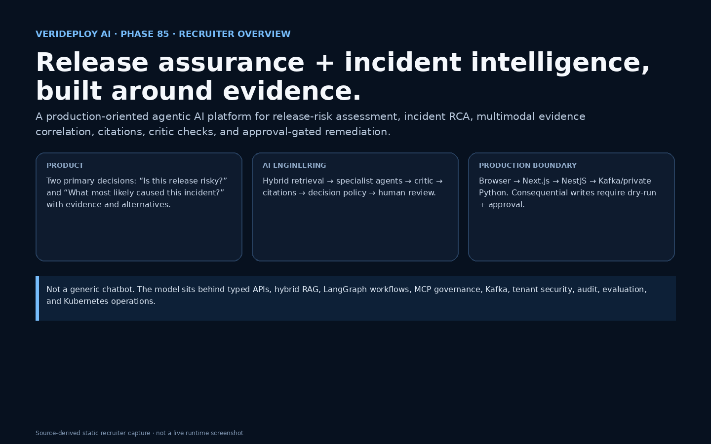
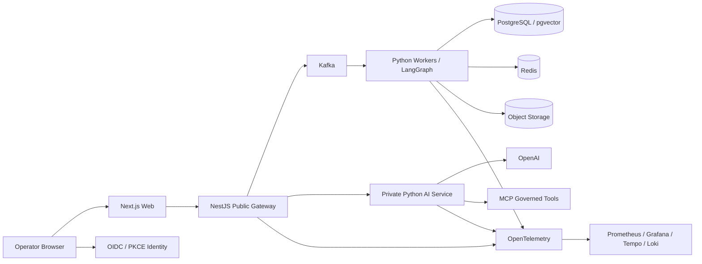
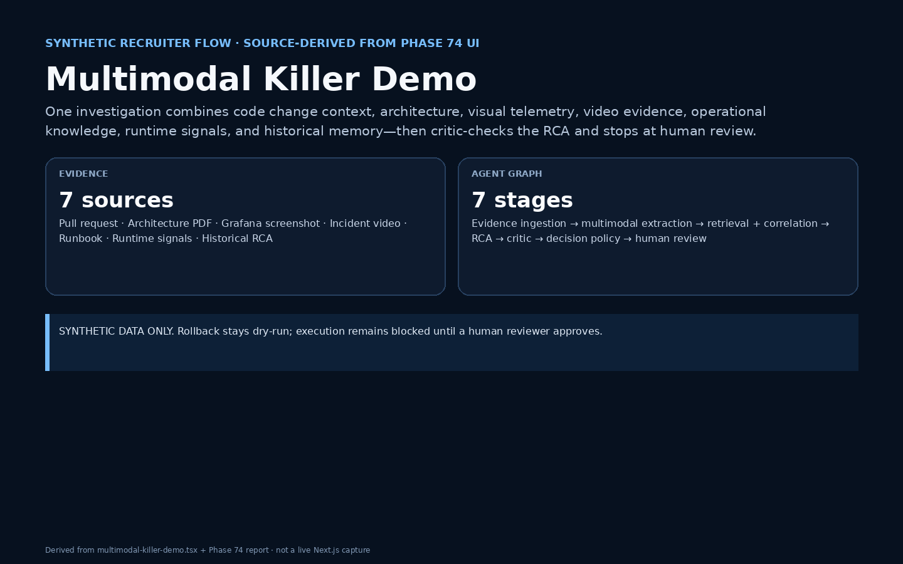
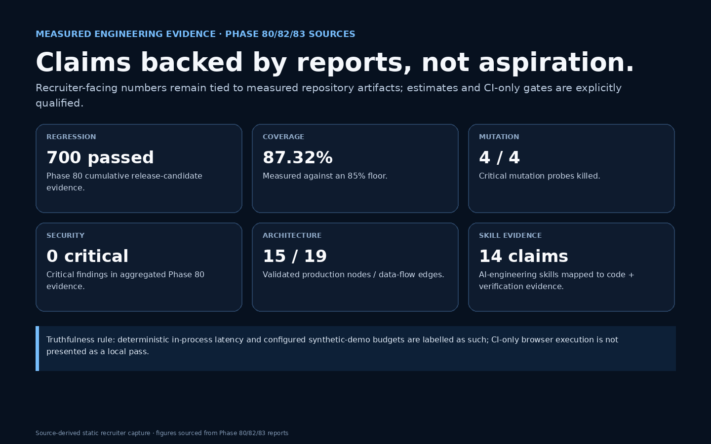

# VeriDeploy AI

**Production-Grade Agentic Release Assurance and Incident Intelligence**  
Cumulative implementation: **Phase 85** · Release **0.85.0** · Recruiter demos use **synthetic data only**.



## What VeriDeploy AI Does

VeriDeploy AI helps engineering teams assess release risk and investigate incidents by correlating code changes, architecture, dashboards, logs/traces, runbooks, documents, screenshots, audio/video, runtime signals, and historical RCAs. It produces evidence-linked conclusions, critic-checks them, and keeps consequential remediation behind a human approval gate.

**Primary workflows**
- Release-risk assessment before deployment.
- Evidence-driven incident RCA during/after production events.
- Multimodal evidence ingestion and timeline correlation.
- Approval-gated remediation and reviewed postmortems.
- Evaluation/LLMOps evidence for retrieval, agents, safety, multimodal quality, and release readiness.

## Why This Is More Than an LLM Wrapper

The repository includes the engineering around the model: OpenAI provider isolation, hybrid RAG, LangGraph orchestration, MCP governance, Kafka eventing, PostgreSQL/pgvector, Redis, S3-compatible storage, OIDC/RBAC/tenant isolation, guardrails, audit integrity, OpenTelemetry, Kubernetes/Helm, CI gates, chaos/load/security/contract tests, and measured evaluation reports.

Retrieved documents, logs, code, issues, transcripts, and web-derived text are treated as **untrusted data**, never as instructions. Consequential writes are disabled by default and require dry-run plus human approval.

## Production Architecture



Canonical machine-readable topology: `config/architecture/production-topology.json`  
Generated topology: `docs/architecture/phase-82-topology.mmd`  
Generated sequence/data flow: `docs/architecture/phase-82-data-flow.mmd`

The browser never calls the private Python AI service directly.

## Live End-to-End Flows

### Release risk
`Browser → Next.js → NestJS → Kafka command → release-risk worker/graph → evidence + policy/RAG → persisted decision → Kafka/WebSocket → live UI`

### Incident RCA
`Browser → NestJS → Kafka → investigation worker → evidence retrieval → specialist agents → critic → citations → audit → persisted RCA → live reconciliation`

### Multimodal evidence
`Upload → NestJS ingestion → object storage → Kafka → multimodal worker → redacted derivatives/evidence IDs → timeline/fusion → investigation graph`

### Consequential remediation
`Recommendation → dry-run → approval request → authenticated human reviewer → audited decision → execution remains blocked until approved`



## Recruiter Demo Path

1. `/demos` — five synthetic production workflows.
2. `/demos/multimodal-killer` — PR + architecture PDF + Grafana image + incident video + runbook + runtime signals + historical RCA.
3. `/incidents` — investigation state, graph events, evidence, citations and alternatives.
4. `/approvals` — demonstrate that consequential actions stay blocked for human review.
5. `evals/reports/` — show what was actually measured.

Detailed setup/demo: `docs/recruiter/setup-and-demo.md`  
Video script: `docs/recruiter/demo-video-script.md`

## Measured Engineering Evidence

| Evidence | Measured result | Evidence file |
|---|---:|---|
| Phase 80 regression | 700 passing tests | `evals/reports/release-candidate-benchmarks.json` |
| Python coverage | 87.32% | same report |
| Critical mutation probes | 4/4 killed | same report |
| Security critical findings | 0 | same report |
| Hybrid RAG Recall@5 | 1.00 | `evals/reports/rag-performance.json` |
| Hybrid RAG MRR | 1.00 | Phase 76 report |
| Agent path score | 1.00 | `evals/reports/agentic-orchestration.json` |
| Multimodal clean traceability | 100% | `evals/reports/multimodal-integration.json` |
| Critical operational gaps | 0 | `evals/reports/production-operations.json` |
| Validated architecture | 15 nodes / 19 flows | `evals/reports/final-production-architecture.json` |
| Evidence-backed AI skills | 14 | `evals/reports/ai-engineering-jd-mapping.json` |

Interpretation and caveats: `docs/recruiter/benchmark-evidence.md`.



## Security and Safety

- OIDC/PKCE public identity boundary.
- RBAC/ABAC and tenant isolation through API/service/repository/retrieval/cache/database/tool layers.
- MCP risk classification, tenant guards, provenance, sanitizer, timeout/circuit breaker and audit.
- Five-layer input/retrieval/tool-output/operational guardrails.
- Append-only tenant-scoped audit integrity chain.
- External secret references, safe logging, CSP/CORS/CSRF/SSRF controls.
- Consequential changes require human approval; external writes are disabled by default.

Deep dive: `docs/recruiter/security-evaluation.md`.

## Evaluation Strategy

Evaluation covers retrieval Recall/MRR/NDCG, RAG faithfulness/context/citation quality, agent routing/planning/tool/completion/retries/escalation, hallucination/safety, visual/multimodal quality, automated regression budgets, security, chaos/load, contracts, accessibility/browser CI, and production checkpoint gates.

The release-candidate system distinguishes **locally executed evidence** from **CI-enforced evidence** instead of turning missing environment capabilities into false passes.

## Run Locally

Prerequisites: Node.js 22+, pnpm 10+, Python 3.12+, uv, Docker Compose v2.

```bash
cp .env.example .env
corepack enable
pnpm install
uv sync --all-groups
docker compose up -d --build
```

Then open `http://localhost:3000`. Never commit `.env`; use synthetic/authorized data only.

Full instructions: `docs/recruiter/setup-and-demo.md` and `docs/operations/local-development.md`.

## Known Limitations

This is a production-oriented portfolio system, not a claim that it has already operated a specific enterprise workload at customer scale. Final real-environment validation still includes managed-cloud dependency tests, live browser evidence, live backup/restore and failure drills, network/provider benchmarks, and release signatures/provenance generated in a trusted networked pipeline.

Read: `docs/recruiter/limitations.md`.

## Interview Walkthrough

Use `docs/recruiter/interview-walkthrough.md` for a 15-minute senior-engineer explanation and `docs/career/resume-impact-and-interview-evidence.md` for STAR stories, trade-offs, failure lessons, cost/latency qualification, and recruiter questions.

## Repository Guide

| Path | Purpose |
|---|---|
| `apps/web/` | Next.js production UI |
| `apps/gateway/` | NestJS public API/security boundary |
| `services/ai/` | Private Python AI/control service |
| `workers/` | Kafka ingestion/investigation/multimodal workers |
| `src/verideploy/rag/` | RAG ingestion/retrieval/rerank/citation pipeline |
| `src/verideploy/agents/` | Supervisor and specialist agents |
| `src/verideploy/graphs/` | LangGraph state/workflow runtime |
| `src/verideploy/mcp/` | Governed MCP gateway/tooling |
| `infrastructure/helm/` | Kubernetes release chart |
| `infrastructure/observability/` | OTel/Prometheus/Grafana/Tempo/Loki |
| `contracts/` | OpenAPI/AsyncAPI/final response-event schemas |
| `evals/reports/` | Measured evaluation/release evidence |
| `docs/decisions/` | Architecture decision records |
| `docs/recruiter/` | Recruiter/senior-engineer explanation package |

## Recruiter / Senior-Engineer Package

- Product narrative — `docs/recruiter/product-narrative.md`
- Setup and demo — `docs/recruiter/setup-and-demo.md`
- Video script — `docs/recruiter/demo-video-script.md`
- Measured benchmark evidence — `docs/recruiter/benchmark-evidence.md`
- Security/evaluation — `docs/recruiter/security-evaluation.md`
- Limitations — `docs/recruiter/limitations.md`
- Interview walkthrough — `docs/recruiter/interview-walkthrough.md`
- AI JD mapping — `docs/career/ai-engineering-jd-mapping.md`
- Resume/STAR evidence — `docs/career/resume-impact-and-interview-evidence.md`

## Status

Cumulative through **Phase 85**. Phase 86 is the final production release, deployment, and handoff phase.

## Phase 86 Final Production Release and Handoff

**Current cumulative release: `0.86.0` (Phase 86 of 86).** The recruiter README/explanation package established in **Phase 85 / 0.85.0** remains the presentation layer; Phase 86 adds the production handoff boundary.

Production release assets now include four versioned image definitions, Helm `0.86.0`, a Terraform plan/apply baseline, explicit migration and safe rollback procedures, backup/restore verification requirements, a keyless cosign release workflow, demo deployment/seeding scripts, final release notes, and a complete technical handoff.

Start with [`docs/release/production-deployment.md`](docs/release/production-deployment.md) for deployment and [`docs/release/final-technical-handoff.md`](docs/release/final-technical-handoff.md) for the operating/explanation package. Registry push, keyless signing, live Terraform apply, Kubernetes rollout, and live restore evidence must be produced in the trusted target environment; this repository does not represent those external operations as having run locally when they have not.
