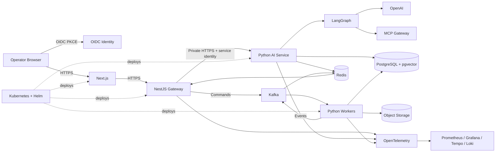
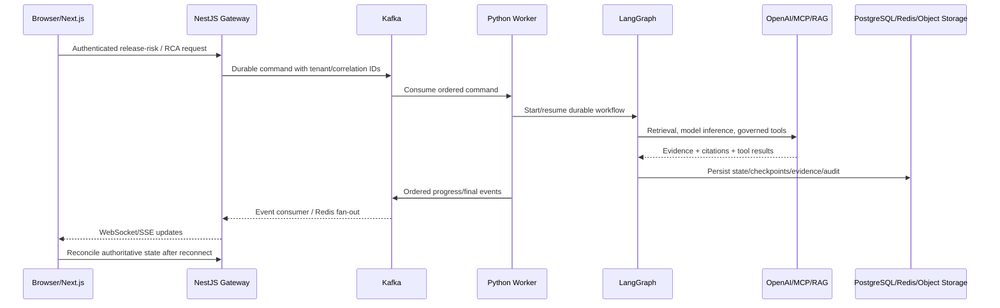

# Phase 82 — Final Production Technology Architecture

Release: **0.82.0**

This document is generated from `config/architecture/phase82-production-topology.json`. It describes the deployed production boundary; it is not a conceptual alternate architecture.

## Production topology

## End-to-end data flow

## Boundary rules

- Next.js is the browser/operator experience; it calls NestJS only.
- NestJS is the sole public application API and realtime boundary.
- Kafka carries durable commands/events to Python workers.
- Python AI services and workers own RAG, LangGraph, OpenAI and MCP execution.
- PostgreSQL/pgvector is authoritative durable state/vector storage; Redis is cache/coordination/fan-out; object storage holds multimodal evidence.
- OIDC/PKCE and service identity protect user and service boundaries.
- Kubernetes/Helm defines production workloads; Compose provides local parity.
- OpenTelemetry feeds Prometheus/Grafana/Tempo/Loki for operations.

## Validation

`scripts/validate_phase82_architecture.py` compares this topology model with release metadata, Helm chart/workload/image versions, Compose services, required runtime paths, and security boundary invariants.
